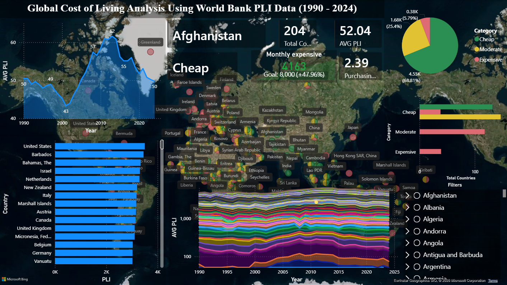
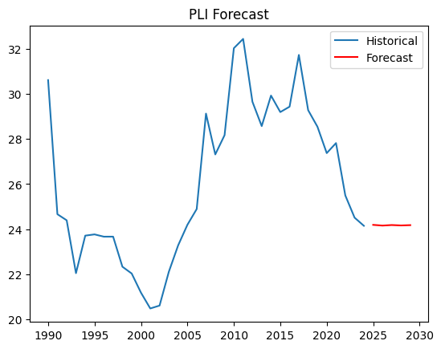
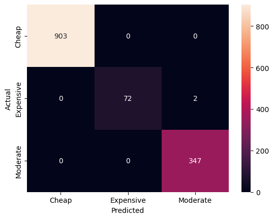

# 
Global Cost of Living Analysis using Price Level Index (PLI)

## Table of Contents

* [Project Overview](#project-overview)
* [Dataset Description](#dataset-description)
* [Data Preprocessing](#data-preprocessing)
* [Feature Engineering](#feature-engineering)
* [Exploratory Data Analysis (EDA)](#exploratory-data-analysis-eda)
* [Power BI Dashboard](#power-bi-dashboard)
* [Dashboard Images](#dashboard-image)
* [Machine Learning (Classification)](#machine-learning-classification)
* [Model Testing](#model-testing)
* [Limitations](#limitations)
* [Future Work](#future-work)
* [Time Series Forecasting](#time-series-forecasting)
* [Key Economic Concepts](#key-economic-concepts)
* [Tech Stack](#tech-stack)
* [Project Outcome](#project-outcome)
* [Prediction output Image](#prediction-output-image)
* [Conclusion](#conclusion)
* [Pro-Level Add-ons](#pro-level-add-ons)

---

##  Project Overview

This project analyzes global cost-of-living differences using the **World Bank Price Level Index (PLI)** dataset. The goal is to understand how expensive each country is relative to a common base (United States = 100) and to derive insights into purchasing power, economic structure, and global price disparities.

> Core:
> **“How expensive is each country compared to a common base (USA) over time?”** 

---

# Dataset Description

### Source:

* World Bank – World Development Indicators (WDI)

### Key Columns:

* **Country** → Country name
* **Year** → Time period
* **PLI** → Price Level Index (main variable)

### Removed:

* Metadata columns (irrelevant for analysis)

---

# Data Preprocessing

### Steps Performed:

* Removed unnecessary metadata columns
* Renamed columns for clarity
* Converted data types (Year → int, PLI → float)
* Handled missing values

---

# Feature Engineering

### ✔ Created:

**Real_Power_Index**

$$
Real\ Power = \frac{100}{PLI}
$$

Interpretation:

* Low PLI → High purchasing power
* High PLI → Low purchasing power
 
---

### ✔ Classification Labels

#### Fixed Categories:

* Cheap → PLI < 60
* Moderate → 60 ≤ PLI ≤ 100
* Expensive → PLI > 100

#### Dynamic Categories:

* Based on quantiles (relative distribution)

---

# 📈 Exploratory Data Analysis (EDA)

## Global Trends

* Analyzed average PLI over time
* Observed convergence (2000–2012) and divergence (post-2013)

## Country-Level Analysis

* Compared India, USA, China
* Identified cost differences across economies

## Rankings

* Top 10 expensive countries
* Top 10 cheapest countries

## Key Insights

* Most countries have **PLI < 100 (cheaper than USA)**
* Global distribution is **right-skewed**
* High-cost economies are rare and often developed or island nations

---

# Power BI Dashboard

### Features:

* KPI Cards (Avg PLI, Purchasing Power)
* Global Map (Cost distribution)
* Trend Analysis (PLI over time)
* Country comparison charts
* Top/Bottom country rankings
* Category distribution

### Example Conversion

#### Assume:

* USA (base): PLI = 100
* India: PLI = 40

Scenario: You have $100 Purchasing Power: 
| Country	| PLI	Real | Purchasing Power |
|---|---|---|
| USA	| 100 | $100|          
| India | 40 | $250 equivalent |

### Calculation:

Real Value in India = 100 / 40 × 100 = 250

Meaning: $100 in USA ≈ $250 worth of goods in India

## Dashboard Image

---

# Machine Learning (Classification)

## Objective:

Classify countries into:

* Cheap
* Moderate
* Expensive

---

## Features Used:

* Real_Power_Index
* Year

(PLI removed to avoid data leakage)

---

## Models Used:

* Logistic Regression
* Random Forest Classifier

---

## Evaluation Metrics:

* Accuracy
* Confusion Matrix
* Classification Report

---

## Results:

* Achieved **~99% accuracy**
* Minimal misclassification between Moderate and Expensive

### Important Insight:

* Original model had **data leakage (PLI → Category)**
* Fixed to ensure meaningful learning

---

## Feature Importance

* Real_Power_Index → High influence
* Year → Minimal impact

---

# Model Testing

### ✔ Methods Used:

* Train-test split
* Confusion matrix visualization
* Real sample predictions
* Model persistence using `.pkl`

---

# Limitations

* Dataset lacks external economic features (GDP, inflation, etc.)
* Classification problem is partially rule-based
* Time dependency not fully utilized in ML model

---

# Future Work (Advanced ML)

## Time Series Forecasting

### Objective:

Predict future PLI values

### Models:

* ARIMA
* Prophet
* LSTM (advanced)

---

## Enhancements:

* Add GDP, inflation, exchange rates
* Build hybrid ML + Time Series model
* Deploy using API / dashboard

---

# Key Economic Concepts

## Price Level Index (PLI)

$$
PLI = \frac{PPP}{Exchange\ Rate} \times 100
$$

## Purchasing Power

$$
Real\ Value = \frac{Nominal}{PLI} \times 100
$$

-> Lower PLI → Higher purchasing power 

---

# Final Insights

* Most countries are significantly **cheaper than developed economies**
* Purchasing power varies widely across regions
* A small group of countries dominates the **high-cost segment**
* Global price structures reflect **economic development, currency strength, and market dynamics**

---

# 🛠 Tech Stack

* **Python** (Pandas, NumPy, Scikit-learn, Statsmodels)
* **Power BI**
* **Matplotlib / Seaborn**

---

# Project Outcome

This project successfully:

* Analyzed global cost structures
* Built an interactive dashboard
* Developed a classification model
* Prepared groundwork for time-series forecasting

# Prediction output Image

- Prediction

- Matrics

---

# Conclusion

This project demonstrates how economic data can be transformed into meaningful insights using data analysis, visualization, and machine learning. It highlights global inequalities in cost of living and provides a foundation for predictive modeling of economic indicators.

---

## Final Story
This analysis examines global cost-of-living differences using the World Bank’s Price Level Index (PLI) dataset from 1990 to 2024, where PLI measures how expensive a country is relative to the United States (base = 100). After cleaning and structuring the data, additional features such as a Real Power Index (inverse of PLI) and both fixed and dynamic classifications were created to capture absolute and relative economic positions. Statistical analysis revealed that the global average PLI is around 52, with a median near 46, indicating that most countries are significantly cheaper than the United States, offering roughly 2–3 times higher purchasing power for the same amount of money. The distribution is right-skewed, showing that while the majority of countries fall into the low-cost category, a small group of high-income and island economies—such as Bermuda, Switzerland, and Iceland—exhibit very high price levels due to factors like strong currencies, high wages, and import dependency. Outliers were identified and handled using the IQR method to ensure robust insights without distortion from extreme values. Trend analysis suggests periods of global price convergence and divergence, reflecting shifts in economic development and currency dynamics over time. Comparative analysis across countries highlights a clear structural divide between developing economies with low cost levels and developed economies with high cost structures. Overall, the study demonstrates that global purchasing power is highly uneven, with most countries remaining relatively affordable compared to developed benchmarks, providing valuable insights for economic policy, international business strategy, and cost-of-living comparisons.

---